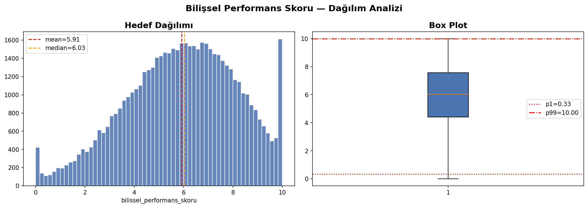
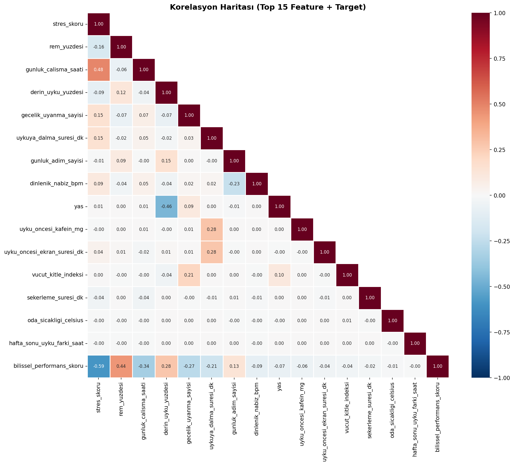
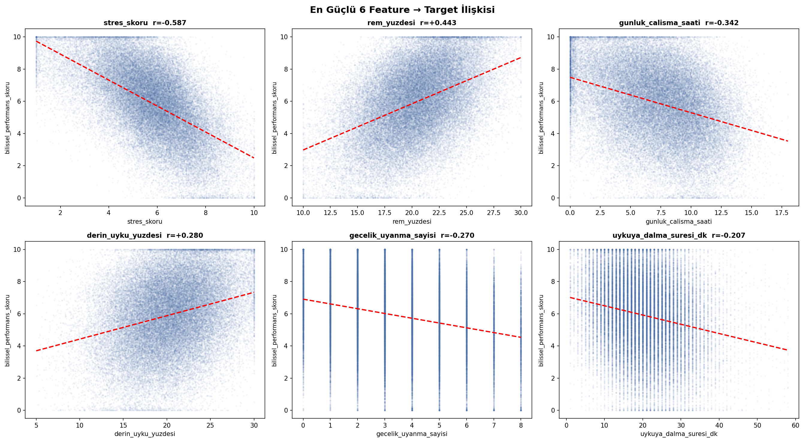
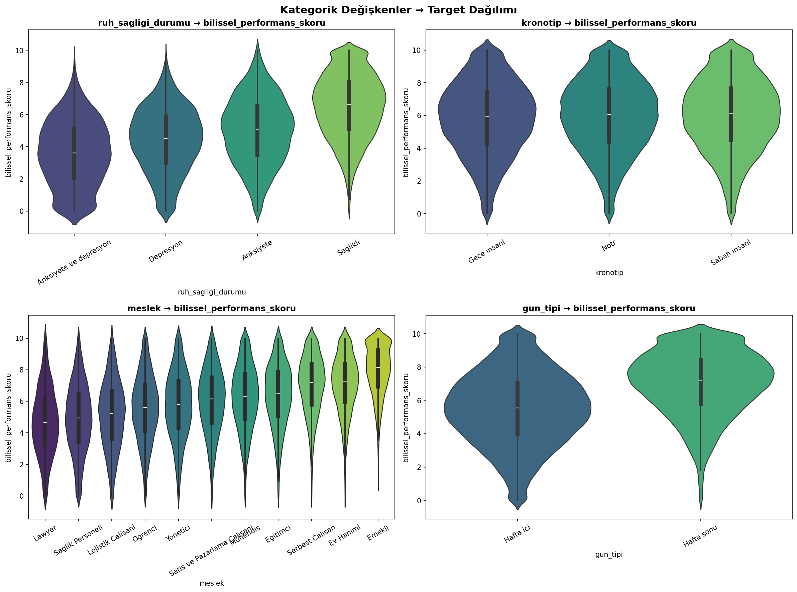
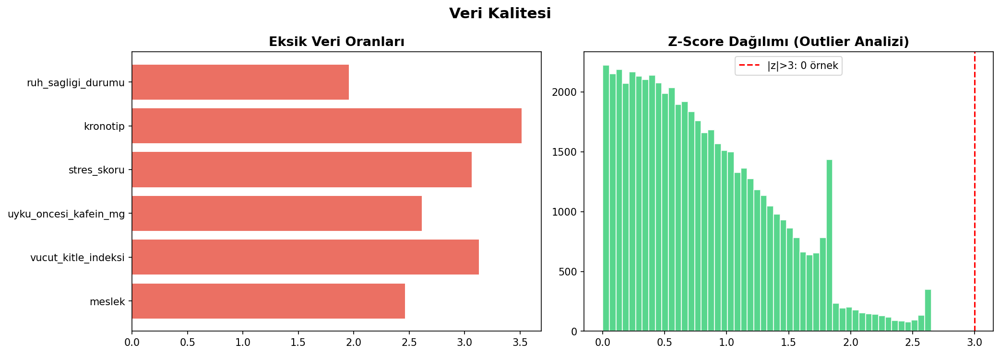
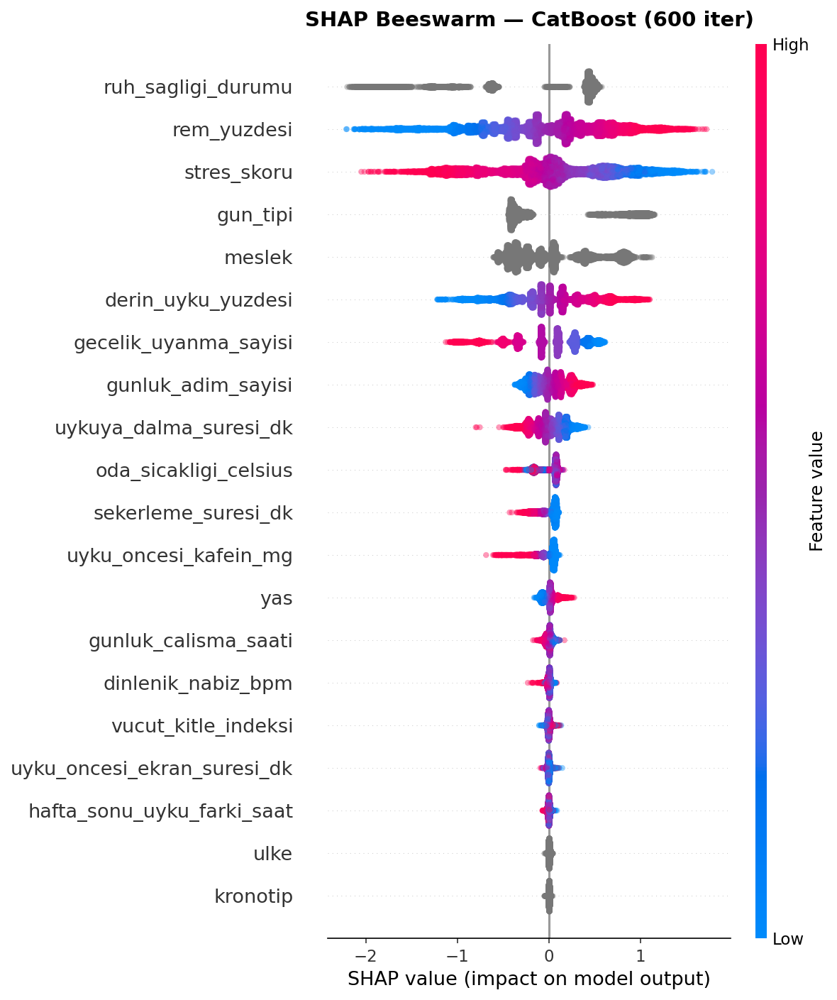
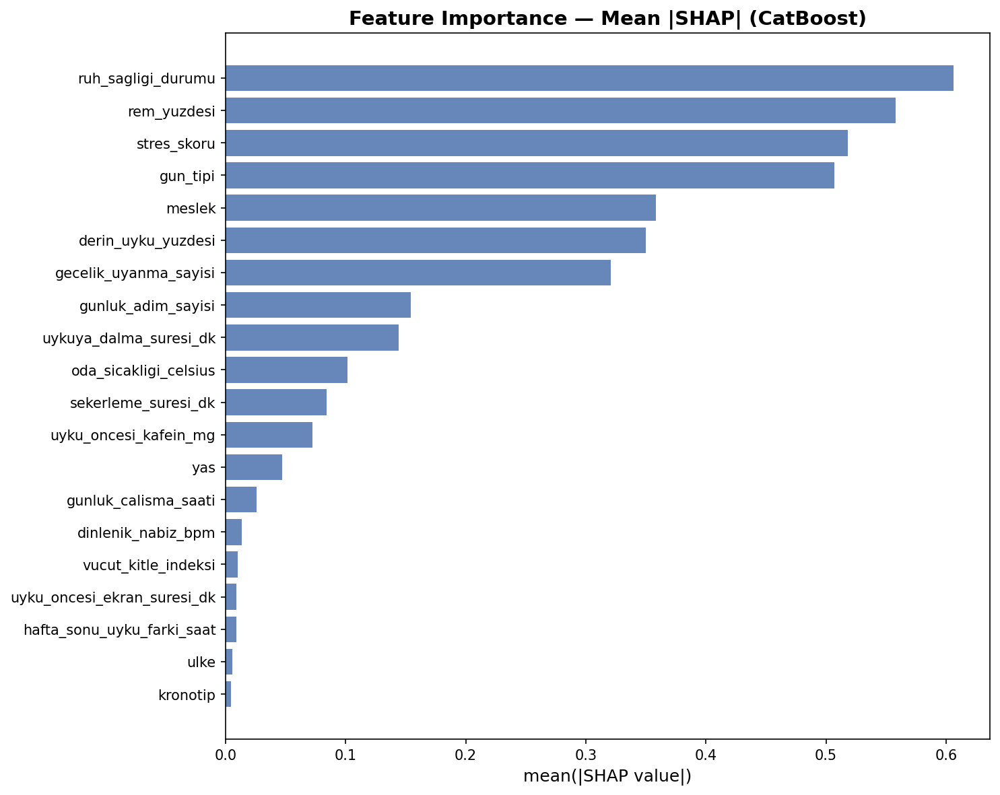
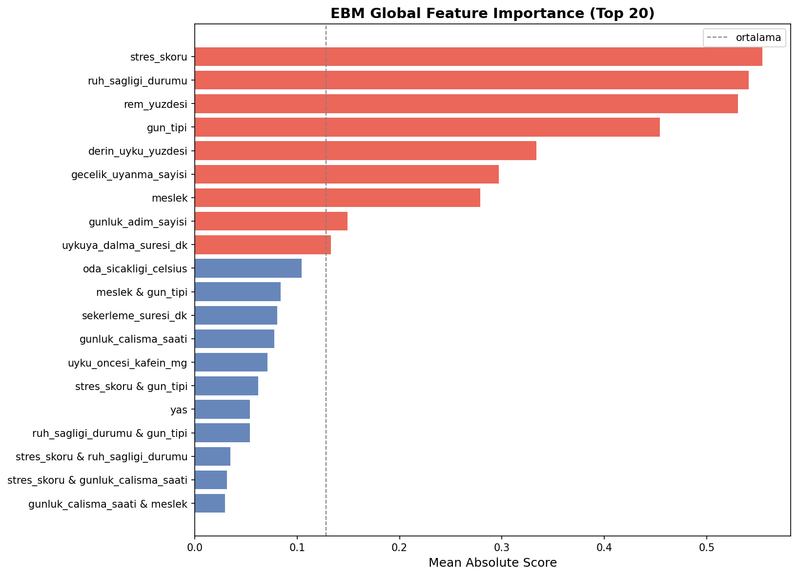
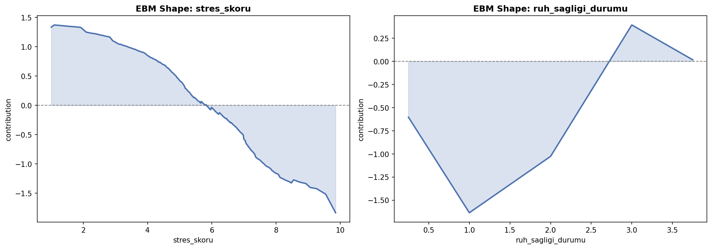

# 🧠 YZTA 2026 Datathon — ML Pipeline

<div align="center">


**Bilişsel performans skorunu tahmin eden çok katmanlı makine öğrenmesi pipeline'ı**

*YZTA 2026 Datathon · Takım 75 · LB RMSE: 1.20356*

> **Not:** Bu yarışma yalnızca YZTA bursiyerlerine özeldir.

</div>

---

## 📋 İçindekiler

- [Genel Bakış](#genel-bakış)
- [Mimari](#mimari)
- [Kurulum](#kurulum)
- [CLI Kullanımı](#cli-kullanımı)
- [Pipeline Aşamaları](#pipeline-aşamaları)
- [Proje Yapısı](#proje-yapısı)
- [Geliştirici](#geliştirici)

---

## Genel Bakış

Uyku kalitesi, stres düzeyi ve günlük aktivite verilerinden `bilissel_performans_skoru` (0–10) tahmin eden end-to-end ML sistemi.

**Veri seti:** 56.000 eğitim / 24.000 test örneği, 23 özellik  
**Hedef:** RMSE minimizasyonu — 0–10 ölçekli bilişsel performans skoru  
**Altyapı:** Microsoft Azure (cloud) — toplam eğitim süresi ~14 saat

**Pipeline çıktısı:**
- 100+ türetilmiş özellik (uyku mimarisi, stres kompozitleri, PCA/ICA, GMM rejim)
- 5 model ailesi: CatBoost, LightGBM, XGBoost, MLP, Ridge
- **800+ model eğitimi** — 5 model × 4 target × 8 seed × 5 fold + pseudo-label turu (~50 fold geçişi, ~14 saat Azure)
- 3 katmanlı ensemble: Caruana FS → L2 Ridge/LGB meta → L3 blend
- Pseudo-labeling ile test setinden güvenilir örneklerin geri beslenmesi

---

## Mimari

```
data/raw/
  ├── train.csv
  └── test_x.csv
        │
        ▼
┌─────────────────────────────────────┐
│         FeatureEngineer             │
│  • 50+ domain features              │
│  • Age-relative z-scores            │
│  • Smoothed target encoding         │
│  • PCA · ICA · GMM regime           │
│  • Frequency encoding               │
└────────────────┬────────────────────┘
                 │  processed_data.parquet
                 ▼
┌─────────────────────────────────────┐
│           ModelEngine               │
│  multi-model × multi-seed × 10-fold │
│  CatBoost · LightGBM · XGBoost      │
│  MLP · Ridge                        │
│  + Round 2: Pseudo-labeling         │
└────────────────┬────────────────────┘
                 │  oof_*.npy  test_*.npy
                 ▼
┌─────────────────────────────────────┐
│          EnsembleEngine             │
│  L1: Caruana Forward Selection      │
│  L2: Ridge meta + LGB meta          │
│  L3: Optuna blend                   │
└────────────────┬────────────────────┘
                 │
                 ▼
           submission.csv
```

---

## Kurulum

```bash
git clone https://github.com/emirhuseynrmx/datathonyzta.git
cd datathonyzta

# uv ile (önerilen — lock dosyası ile tam tekrarlanabilir ortam)
uv sync

# pip ile (alternatif)
python -m venv venv
source venv/bin/activate          # Windows: venv\Scripts\activate
pip install -e ".[dev]"
```


## CLI Kullanımı

Tüm pipeline tek bir CLI üzerinden çalışır:

```bash
python datathoncore.py --help
```

```
Commands:
  info            Sistem ve donanım özetini gösterir
  preprocess      Feature engineering + parquet çıktısı
  eda             Keşifsel veri analizi grafikleri
  adversarial     Train/test dağılım kayması testi
  hpo             Optuna HPO (CatBoost veya LightGBM)
  engine          Multi-model OOF eğitimi
  stack           Caruana FS + L2/L3 ensemble
  optimize-stack  Optuna ile L2/L3 ağırlık optimizasyonu
  predict         submission.csv üretimi
  check           Ruff + mypy kod kalitesi denetimi
  test            Pytest + coverage raporu
```

### Tam Pipeline (sırayla)

```bash
python datathoncore.py preprocess
python datathoncore.py hpo --trials 100
python datathoncore.py engine --model catboost --model lightgbm
python datathoncore.py stack
python datathoncore.py optimize-stack
python datathoncore.py predict
```

---

## Pipeline Aşamaları

### 1. Preprocess — Feature Engineering

`FeatureEngineer.fit_transform()` şu grupları üretir:

| Grup | Özellik Sayısı | Örnek |
|---|---|---|
| Uyku mimarisi | 12 | `sleep_efficiency`, `rem_to_deep_ratio`, `social_jetlag` |
| Stres kompozitleri | 8 | `stres_squared`, `stres_x_rem`, `stres_per_total_sleep` |
| Aktivite–dinlenme | 6 | `activity_recovery`, `metabolic_proxy` |
| Logaritmik dönüşüm | 5 | `log_kafein`, `log_adim`, `log_stres_x_deep` |
| Kategorik etkileşimler | 8 | `meslek_ruh_sagligi`, `chronotype_daytype` |
| Smoothed target encoding | 5 | `all_cat_te`, `meslek_ruh_te` |
| Boyut indirgeme | 15 | `pca_1..5`, `ica_1..5`, `gmm3/5/7_prob` |
| Frekans & yaş-z | 10 | `freq_meslek`, `stres_skoru_age_zscore` |

### 2. HPO — Optuna

```bash
python datathoncore.py hpo --model catboost --trials 200
python datathoncore.py hpo --model lightgbm --trials 200
```

En iyi parametreler `models/best_cb_params.json` / `best_lgb_params.json` olarak kaydedilir.

### 3. Engine — Çok-Modelli Eğitim

- **800+ model** — 5 model ailesi × 4 target stratejisi × 8 seed × 5 fold (~50 fold geçişi)
- Her (model, target) çifti için `oof_<key>.npy` + `test_<key>.npy` incremental kayıt
- **Round 2**: Yüksek güvenilirlikli test örnekleri (model std ≤ P25) ile pseudo-labeling

### 4. Stack — 3 Katmanlı Ensemble

```
L1  Caruana Forward Selection  — greedy, diversity-aware
L2  Ridge meta + LightGBM meta — OOF matrisinden öğrenen meta-modeller
L3  Optuna blend               — L1/L2 ağırlıklarını optimize eder
```

---

## Analizler & Görseller

### EDA — Keşifsel Veri Analizi

| Target Dağılımı | Korelasyon Haritası |
|---|---|
|  |  |

| Feature → Target | Kategorik Değişkenler |
|---|---|
|  |  |



---

### SHAP — Model Yorumlanabilirliği (CatBoost)

| Beeswarm (Raw SHAP) | Mean \|SHAP\| Importance |
|---|---|
|  |  |

> Her nokta bir örneği temsil eder. Renk feature değerini (kırmızı=yüksek, mavi=düşük), x-ekseni ise o feature'ın tahmine katkısını gösterir.

---

### EBM — Explainable Boosting Machine

| Global Feature Importance | Shape Functions (Top 2) |
|---|---|
|  |  |

> EBM (InterpretML), her feature için bağımsız şekil fonksiyonu öğrenen yorumlanabilir bir gradient boosting modelidir. SHAP ile karşılaştırıldığında post-hoc değil, intrinsically interpretable bir yaklaşım sunar.

---

## Proje Yapısı

```
.
├── datathoncore.py          # CLI giriş noktası
├── download_data.py         # Kaggle'dan veri indirme
├── round_submission.py      # Submission CSV'yi 2 ondalığa yuvarla
├── final_push.py            # Standalone CB+LGB+XGB blend
├── pyproject.toml           # Bağımlılıklar, ruff, mypy ayarları
├── .env.example             # Ortam değişkenleri şablonu
├── deep_dive_results.txt    # Derin korelasyon & etkileşim analizi
├── src/
│   ├── config.py            # Pydantic settings
│   ├── data/
│   │   ├── loader.py        # Train + test yükleyici
│   │   └── schema.py        # Giriş veri şeması
│   ├── features/
│   │   ├── engineering.py   # Feature factory (100+ özellik)
│   │   ├── eda.py           # EDA raporu
│   │   └── adversarial.py   # Adversarial validation
│   ├── models/
│   │   ├── engine.py        # Multi-model eğitim motoru
│   │   ├── ensemble.py      # Caruana FS + meta-modeller
│   │   ├── hpo.py           # Optuna HPO
│   │   ├── target_strategy.py
│   │   └── validator.py     # Stratified K-fold
│   └── utils/
│       └── logger.py        # Loguru yapılandırması
└── tests/
    ├── test_data.py         # Schema + config testleri
    └── test_engineering.py  # Feature engineering testleri
```

---

## Takım 75

**Emir Hüseyin İncı**

[](https://github.com/emirhuseynrmx)
[](mailto:emirhuseyininci@gmail.com)

**İlayda Pekar Özdemir** — Yardımcı Geliştirici

---

<div align="center">
<sub>YZTA 2026 Datathon · Python 3.10+ · Polars · CatBoost · Optuna</sub>
</div>
